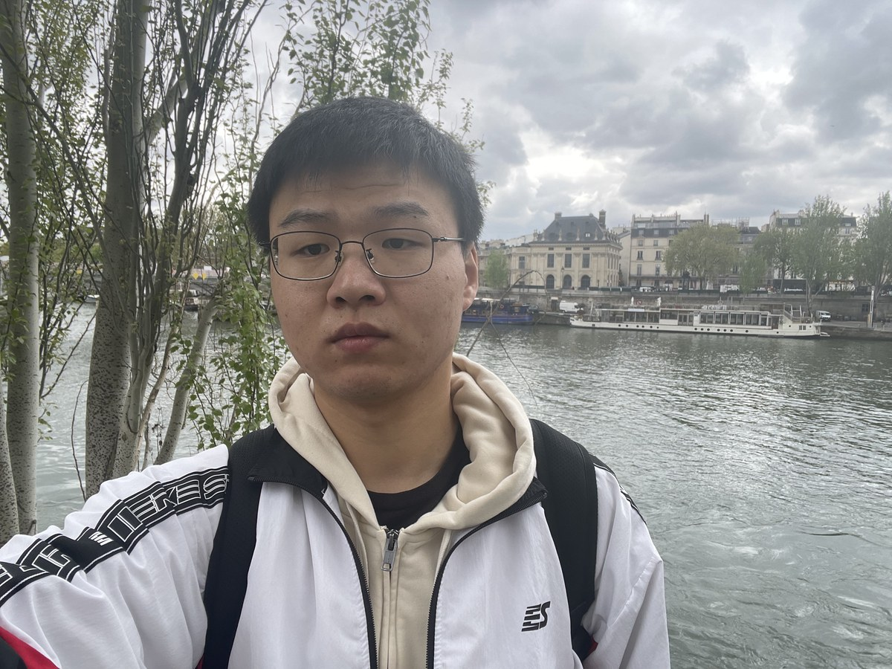

## About Me

Hi, welcome to **Zhipeng Song's** homepage. 
I obtained my PhD at Ghent University and Université Marie et Louis Pasteur. My research interests include: Harmonic analysis on symmetric spaces and PDEs on Lie groups. I am currently on the academic job market.

<figure class="profile-photo">
    
</figure>

## Educations

- **2021.12 -- 2026.03**, PhD, **Université Marie et Louis Pasteur** and **Universiteit Gent**, Supervisors: [Yulia Kuznetsova](https://ykuznetsova.pages.math.cnrs.fr/index.html) and [Michael Ruzhansky](https://ruzhansky.org)
- **2020.08 -- 2021.12**, PhD candidate , **Harbin Institute of Technology**, Supervisor: [Quanhua Xu](https://quanhuaxu.pages.math.cnrs.fr)
- **2016.08 -- 2020.06**, BS, **Harbin Institute of Technology**
  
## Publications

1. (With **Y. Kuznetsova**) Pointwise and uniform bounds for functions of the Laplacian on non-compact symmetric spaces, 2024, preprint, [arxiv](https://arxiv.org/abs/2409.02688)
2. (With **Y. Kuznetsova**) Shifted wave equation on non-compact symmetric spaces, 2025, preprint, [arxiv](http://arxiv.org/abs/2504.21479)

## Presentations
- **2026.08** --- Pseudo-differential operators on the ax+b group, at Shanxi, China
- **2026.07** --- Pseudo-differential operators on the ax+b group, at Yunnan, China
- **2026.04** --- Wave equations on noncompact Riemannian symmetric spaces, at Séminaire Théorie de Lie, Géométrie et Analyse, Metz, France
- **2026.03** --- Multipliers on Lie groups of exponential growth, at Séminaire Analyse Fonctionnelle, Besançon, France
- **2026.03** --- Multipliers on Lie groups of exponential growth, at Analysis seminar, Harbin, China
- **2025.06** --- Shifted wave equation on non-compact symmetric spaces, at Research seminar "Geometric and Harmonic Analysis", Paderborn, Germany
- **2025.06** --- Shifted wave equation on non-compact symmetric spaces, at Session Poster - Congrès de la SMF, Dijon, France
- **2025.01** --- Estimate of the kernels for functions of Laplacian on noncompact symmetric spaces, at Séminaire Analyse Fonctionnelle, Besançon, France
- **2024.04** --- Pointwise and uniform bounds for functions of the Laplacian on symmetric spaces of non-compact type, at Young Functional Analysts’ Workshop, Newcastle, UK
- **2023.07** --- Weak amenability for SU(1,n) and Sp(1,n): harmonic analysis on the parabolic part, at Tianyuan Summer Seminar on Functional Analysis and Spaces 2023, Harbin, China

## Attendance
- **2025.06** --- Hypoellipticity in Lund 2025, Lund, Sweden
- **2023.12** --- Noncommutative analysis on groups and quantum groups ANCG, Besançon, France
- **2023.06** --- École de printemps 2023 du GDR AFHP, Lyon, France 
- **2022.12** --- Arbre de Noël du GDR 2022, Paris, France 
- **2022.11** --- Rencontre 2022 de l’ANR ANCG, Cabourg, France

## Notes
[Notes for GV](./Symbols.pdf)

**Last update**: {{ site.time | date: "%m/%Y" }}
